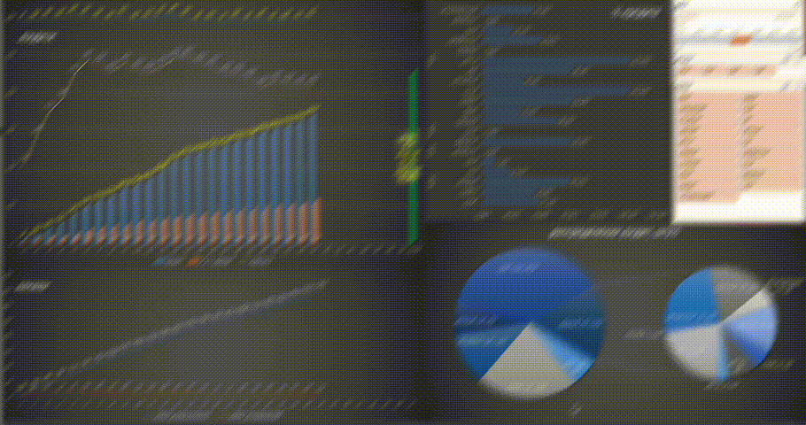

# Автоматический сбор и оперативный анализ реализации и заказов авто
### Описание проекта
Скрипт собирает первичную информацию из файлов `excel` сводит информацию в один `dataframe` открывает 
зарнее подготовленный дашборт с предобработкой `Power Query` обновляет сводные таблицы, сохраняет файл.
Далее производит рассылку `email` пользователям.  
На дашборде информация о реализации авто, кредитах, заказах, темпы, прогнозы и так далее..   
Скрипт прикреплен к планировщику заданий и запускается ежедневно   

Предусмотрено логирование файлов и поиск ошибок, в случае сбоя `email` отправляется ответсвенному лицу,
иначе всем пользователям в основной рассылке  

`ps: ссылки в коде на источники данных изменены, образец дашборда заблюрен (по понятным причинам)
email адреса изменены`


### Панель управления (дашборд)  

      
 

[ОБРАЗЕЦ_дашборда](https://drive.google.com/file/d/1estPL-mlekmpFsL5iePnaM4d-Ed3_vQ3/view?usp=sharing)

### Технологии
````
Python 3.11.4  

pandas, os, win32com.client, datetime, 
smtplib,ssl, email
````
##### _Запуск проекта в dev-режиме_
- установите и активируйте виртуальное окружение (выполните команды):  
```
python3 -m venv venv  
```  
```
source venv/bin/activate  
```  
- Установите зависимости из файла requirements.txt  
```
pip install -r requirements.txt  
```  

### Авторы
Сергей К [ссылка на telegram](https://t.me/magnus_red) 


